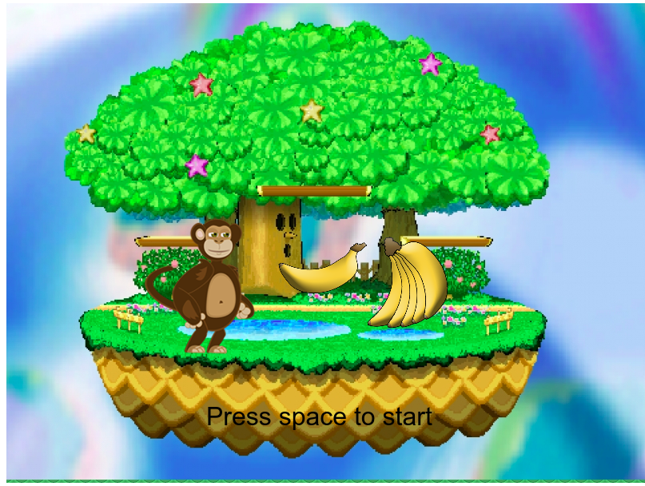
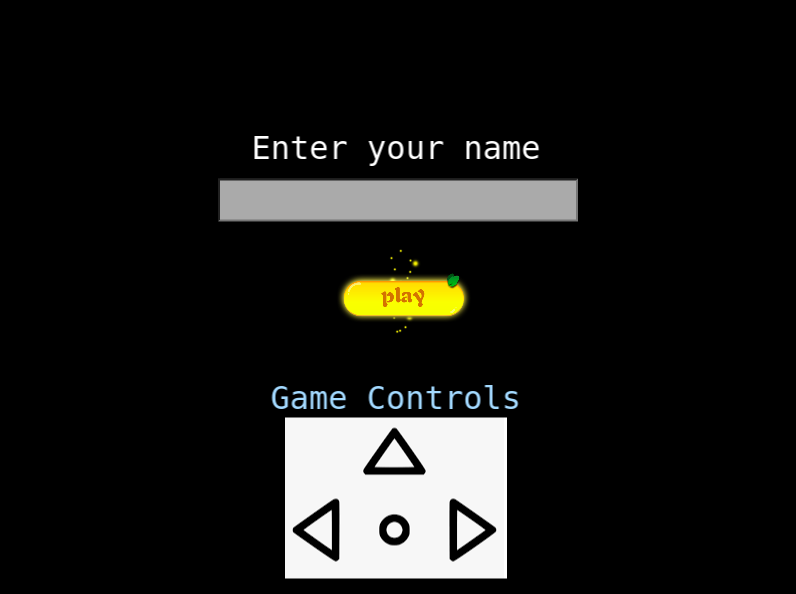
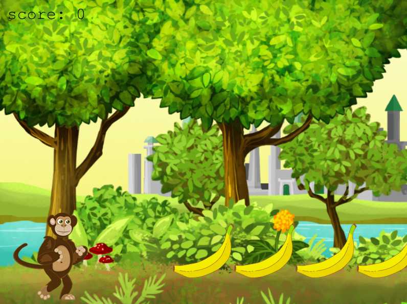
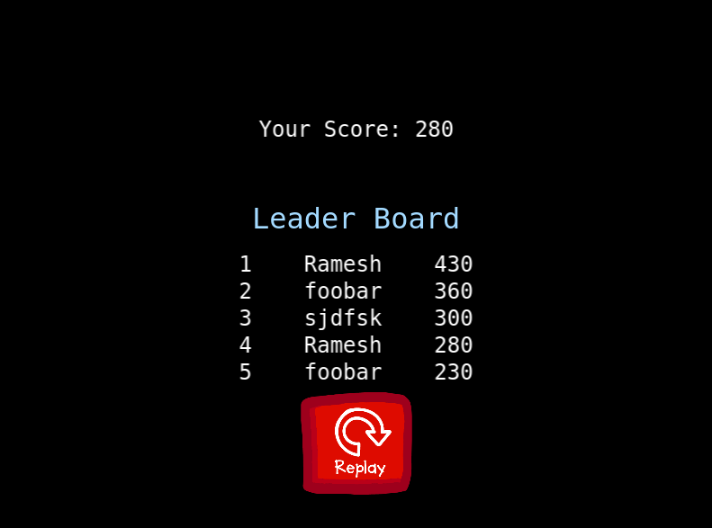

# Por Banana Game

> This video game is based on the concept that a player will help monkey to eat bananas in the forest by escaping from the Wild Cats.

## Table of Contents

- [Concept](#Concept)
- [Game Scenes](#game-scenes)
- [How to Play](#how-to-play)
- [Built With](#built-with)
- [Live Demo](#live-demo)
- [Getting Started](#getting-started)
  - [Installation](#installation)
  - [Usage](#usage)
- [Author](#author)

## Concept

- A monkey is looking for the bananas in a forest. But the Wild Cats are all over roaming around the forest. The player will get bananas for a monkey by helping to escape from the Wild Cats.

## Game Scenes

### Welcome Scene


### Title Scene


### Game Scene


### End Scene


## How To Play

- The monkey can be controlled with arrow keys(UP, LEFT, RIGHT).
  - Left  -   For moving towards Left Direction
  - Right -   For moving towards Right Direction
  - Up    -   For Jumping

## Built With

- [HTML](https://developer.mozilla.org/en-US/docs/Web/html)
- [Javascript](https://developer.mozilla.org/en-US/docs/Web/javascript)
- [CSS](https://developer.mozilla.org/en-US/docs/Web/CSS)
- [Phaser 3](https://www.phaser.io/phaser3)
- [Webpack](https://webpack.js.org/)
- [Babel](https://babeljs.io/)
- [Jest](https://jestjs.io/)
- [Netlify](https://netlify.com/)

## Live Demo

[Live Demo Link](https://por-banana.netlify.app//)

## Getting Started

To get a local copy up and running, follow these simple example steps.

<!-- ### Prerequisites -->

<!-- ### Setup -->

### Installation

Clone the repo with:

```sh
git clone https://github.com/rna/por-banana-game/
```

### Usage

1. Run `npm install` to install all dependencies

2. Run `npm run start` to start the local server

<!-- ## Roadmap -->

<!-- ### Deployment -->

### Author

👤 **Ramesh Naidu Allu**

- Github: [@rna](https://github.com/rna)
- Twitter: [@rnadev](https://twitter.com/rnadev)
- Linkedin: [Linkedin](https://linkedin.com/in/ramesh-naidu)

## 🤝 Contributing

Contributions, issues and feature requests are welcome!

Feel free to check the [issues page](issues/).

## Show your support

Give a ⭐️ if you like this project!

## Acknowledgments

- [Forest Layer](https://opengameart.org/content/forest-scene) by [Ironthunder](https://opengameart.org/users/ironthunder), License: [CC BY 4.0](https://creativecommons.org/licenses/by/4.0/)
- [Monkey & other Game Art](https://opengameart.org/content/forest-scene) by [Marilda](mailto:mariadajko@hotmail.com), License: [CC0 1.0](https://creativecommons.org/publicdomain/zero/1.0/)

## 📝 License

This project is [MIT](lic.url) licensed.